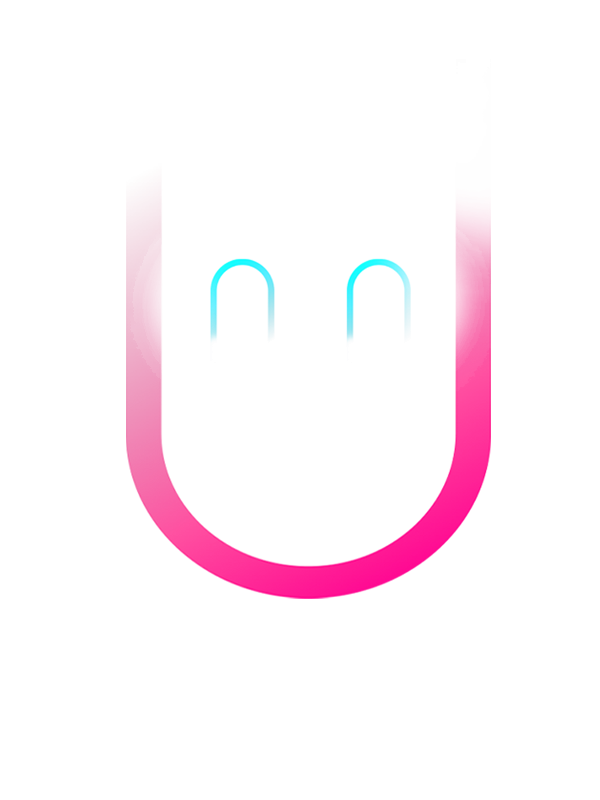

# Chat-Client (Work in Progress)

### Getting Started

To run the Chat Client:
  Open terminal inside the folder and run this command: npm start followed by ctrl + click on http://localhost:3000

# Detailed Code Explanation

This set of files (`server.js`, `main.js`, `index.html`) creates a simple chat application using Node.js, Express, Socket.IO, and client-side JavaScript.

## server.js

### Importing Modules and Setting Up Express
```javascript
const express = require("express");
const path = require("path");
const app = express();
```
- Importing necessary modules.
- Initializing an Express application.

### Setting the Port
```javascript
const PORT = process.env.PORT || 3000;
```
- Setting the port number for the server to listen on. It uses the environment variable `PORT` or defaults to 3000.

### Creating Server and Setting Up Socket.io
```javascript
const server = app.listen(PORT, () => console.log(\`Server is running on port ${PORT}\`));
const io = require("socket.io")(server);
```
- Starting the server.
- Initializing Socket.IO with the server.

### Serving Static Files
```javascript
app.use(express.static(path.join(__dirname, "public")));
```
- Serving static files (like HTML, CSS, JavaScript) from the `public` directory.

### Handling Socket.IO Connections
```javascript
let socketsConnected = new Set();
io.on("connection", onConnected);
```
- Creating a set to track connected sockets.
- Setting up an event listener for new socket connections.

### onConnected Function
```javascript
function onConnected(socket) { ... }
```
- Function that handles a new socket connection.
- Logs the socket ID and manages the set of connected sockets.
- Sets up event listeners for `disconnect`, `message`, and `feedback` events.

## main.js

### Setting Up Socket.IO Client
```javascript
const socket = io();
```
- Initializing the Socket.IO client.

### DOM Elements
```javascript
const clientsTotal = document.getElementById("client-total");
...
```
- Selecting DOM elements for manipulation.

### Event Listeners
```javascript
messageForm.addEventListener("submit", (e) => { ... });
```
- Adding event listeners for form submission, keypress, and focus events.

### Handling Incoming Data from Server
```javascript
socket.on("clients-total", (data) => { ... });
socket.on("chat-message", (data) => { ... });
socket.on("feedback", (data) => { ... });
```
- Handling various events emitted by the server.

### Sending Messages
```javascript
function sendMessage() { ... }
```
- Function to send a message to the server.

### Utility Functions
```javascript
function addMessagetoUI(isOwnMessage, data) { ... }
function scrollToBottom() { ... }
function clearFeedback() { ... }
```
- Functions for UI manipulation like adding messages to the chat, scrolling, and clearing feedback.

## index.html

### Basic HTML Structure
```html
<!DOCTYPE html>
<html lang="en"> ... </html>
```
- Standard HTML5 document structure.

### Importing Styles and Scripts
```html
<link rel="stylesheet" href="..."> 
<script src="/socket.io/socket.io.js"></script>
<script src="main.js"></script>
```
- Including CSS for styling.
- Including Socket.IO client script and the main JavaScript file.

### Chat Interface
- HTML elements for displaying the chat interface, including input fields, message containers, and buttons.

This combination of files creates a real-time chat application where users can send and receive messages instantly. Socket.IO is used for real-time communication between the server and clients.

### Acknowledgments

- Special thanks to The  [Mafia Codes](https://www.youtube.com/@mafiacodes) for guiding me through understanding how the socket.io works
  

